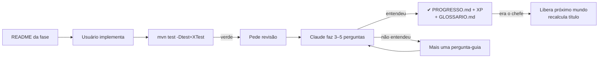

# Trilha em Mundos — Design

**Spec**: `.specs/features/trilha-mundos/spec.md`
**Status**: Draft

---

## Architecture Overview

Só arquivos: Markdown para enunciado/progresso, Java para esqueleto/teste, no mesmo projeto Maven. Nenhum código de "plataforma". Uma abordagem só — não há alternativa que entregue o mesmo escopo com menos.



### Árvore

```
challenges/
├── README.md                 # como a trilha funciona (curto)
├── PROGRESSO.md              # mapa do jogo: XP, título, checkboxes, Próximos mundos
├── GLOSSARIO.md              # links atualizados
├── templates/                # MUNDO.template.md, FASE.template.md, Fase.java.template, FaseTest.java.template
├── archive/
├── m01-sintaxe-strings-arrays/
│   ├── README.md             # briefing: 1 frase + ≤6 tópicos
│   ├── f01-classificador-de-numero/README.md
│   └── chefe-cupom-fiscal/README.md
└── m02-collections/ ...
src/main/java/challenges/m01/f01/Classificador.java
src/test/java/challenges/m01/f01/ClassificadorTest.java
src/main/java/challenges/m01/chefe/CupomFiscal.java
```

`Welcome.java`/`WelcomeTest.java` ficam onde estão (pacote `challenges`).

---

## Code Reuse Analysis

| Existente | Local | Uso |
| --- | --- | --- |
| Esqueleto com `throw new UnsupportedOperationException("TODO: implementar")` | `src/main/java/challenges/day035/SomaPorCategoria.java` | Padrão de toda fase nova |
| Classe utilitária `final` + construtor privado | idem | Fases com métodos `static` |
| Teste comportamental JUnit 5, nomes em português descritivos | `src/test/java/challenges/day043/ContaBancariaTest.java` | Padrão de todo teste novo |
| Escada de 5 níveis de dica | `CLAUDE.md` | Mantida; o novo fluxo só acrescenta revisão/progresso |
| Tabela do glossário | `challenges/GLOSSARIO.md` | Mantida; só os links mudam |

---

## Components

### README do mundo (`challenges/mNN-slug/README.md`)

```markdown
# Mundo NN — Nome
> Uma frase: por que um sênior precisa disso.

- **Conceito** — o que é, numa linha.
  (4–6 tópicos, só conceitos novos)

**Chefe:** nome — o que ele cobra.
**Fonte:** link da seção do dev.java/learn
```

### README da fase (`challenges/mNN-slug/fNN-slug/README.md`)

```markdown
# NN.NN — Nome
**Missão:** 1–2 frases.

**Implemente:** `challenges.mNN.fNN.Classe` → assinatura(s)

**Regras**
- bullets curtos, incluindo casos inválidos e a exceção esperada

**Exemplos**
| Entrada | Saída |

<details><summary>Dica</summary>uma pista de nível 2, nunca o algoritmo</details>

**Revisa:** conceito do glossário / fase anterior
**Rodar:** `mvn test -Dtest=ClasseTest`

⭐⭐☆☆☆ · ~15 min · +20 XP
```

Fases migradas mantêm o README original e ganham só uma linha no topo: `> Antigo desafio NNN · Mundo X, fase Y`.

### Código

- Esqueleto: métodos públicos com `throw new UnsupportedOperationException("TODO: implementar");`. Tipos que o teste instancia (classes, records, enums, interfaces seladas) existem no esqueleto com a forma mínima para compilar.
- Código "dado" (auxiliar que não é o exercício) fica no mesmo pacote com o comentário `// Dado: não altere.`
- Teste: só entrada → saída/exceção. `@TempDir` no Mundo 10. No Mundo 12, `assertTimeoutPreemptively` + número fixo de tarefas, sem `Thread.sleep` como sincronização.

### `PROGRESSO.md`

```markdown
# Progresso
**Título:** Estagiário · **XP:** 420 · **Chefes:** 0/15

## Mundo 1 — Sintaxe, Strings e Arrays ▶ em andamento
- [x] [1.01 Classificador de Número](m01-.../f01-.../README.md) ⭐ +10
...
- [ ] 👑 [Chefe: Cupom Fiscal](...) ⭐⭐⭐ +30

## Mundo 3 — POO 🔒

## Próximos mundos (backlog)
- **Modules (JPMS)** — `module-info`, exports, encapsulamento forte.
```

Títulos por chefes derrotados: 0–1 Estagiário · 2–4 Júnior · 5–8 Pleno · 9–12 Sênior · 13–15 Staff. Em Markdown não dá pra bloquear link; 🔒 é convenção e o CLAUDE.md faz valer (não dá dica de mundo bloqueado sem avisar).

---

## Migração (antigo → novo)

**Mundo 1 — Sintaxe, Strings e Arrays** (`m01`)

| Novo | Antigo | Novo | Antigo | Novo | Antigo |
|---|---|---|---|---|---|
| f01 | 001 | f09 | 013 | f17 | 026 |
| f02 | 002 | f10 | 014 | f18 | 027 |
| f03 | 003 | f11 | 019 | f19 | 028 |
| f04 | 004 | f12 | 020 | f20 | 029 |
| f05 | 005 | f13 | 021 | f21 | 030 |
| f06 | 010 | f14 | 022 | f22 | 040 |
| f07 | 011 | f15 | 024 | f23 | 041 |
| f08 | 012 | f16 | 025 | f24 | 042 |

**Mundo 2 — Collections** (`m02`)

| Novo | Antigo | Novo | Antigo | Novo | Antigo |
|---|---|---|---|---|---|
| f01 | 006 | f07 | 017 | f13 | 034 |
| f02 | 007 | f08 | 018 | f14 | 035 |
| f03 | 008 | f09 | 023 | f15 | 036 |
| f04 | 009 | f10 | 031 | f16 | 037 |
| f05 | 015 | f11 | 032 | f17 | 038 |
| f06 | 016 | f12 | 033 | f18 | 039 |
| chefe | 043 | | | | |

Concluídos (checkbox marcado): 001–034. Pendentes: 035–043.

---

## Mapa das fases novas

Formato: `fase — Nome — Classe — o que pratica — ⭐ · min`. Chefes a partir do Mundo 3 evoluem o **Mercadinho** (produtos → estoque → pedidos → pagamentos → relatórios).

### Mundo 1 — Sintaxe, Strings e Arrays (continuação)
- f25 — Placar Sem Estouro — `PlacarSeguro` — overflow de `int`, `Math.addExact`, `ArithmeticException` — ⭐⭐ · 10
- f26 — Preço com Desconto — `PrecoComDesconto` — `BigDecimal`, `setScale`, `RoundingMode.HALF_EVEN` — ⭐⭐ · 15
- f27 — Tipo do Dia — `TipoDoDia` — `switch` expression, múltiplos rótulos, `yield` — ⭐ · 10
- f28 — Mesmo Código — `ComparadorDeCodigos` — `==` × `equals`, `equalsIgnoreCase`, `strip`, `Objects.equals` — ⭐⭐ · 10
- f29 — Etiqueta Formatada — `EtiquetaFormatada` — `String.format` com largura/precisão, `Locale.ROOT`, `repeat` — ⭐⭐ · 15
- 👑 Chefe — Cupom Fiscal — `CupomFiscal` — `split` + `BigDecimal` + `switch` + `StringBuilder` + `format` — ⭐⭐⭐ · 20

### Mundo 2 — Collections (continuação)
- f19 — Ranking de Jogadores — `Ranking` — `Comparator.comparing`, `reversed`, `thenComparing`, `List.sort` — ⭐⭐ · 15
- f20 — Próximo Ônibus — `ProximoOnibus` — `TreeSet`, `ceiling`/`floor` — ⭐⭐ · 10
- f21 — Pronto-Socorro — `ProntoSocorro` — `PriorityQueue` com `Comparator`, desempate por chegada — ⭐⭐⭐ · 20
- f22 — Coordenada no Mapa — `Coordenada` — contrato `equals`/`hashCode` em `HashSet`/`HashMap` — ⭐⭐ · 15
- f23 — Lista Congelada — `Congelador` — `List.copyOf`, imutabilidade, cópia defensiva — ⭐⭐ · 10
- f24 — Histórico de Navegação — `HistoricoNavegacao` — `LinkedHashSet` + `SequencedCollection.reversed()` (Java 21) — ⭐⭐ · 15
- 👑 Chefe — Conta Bancária com Extrato (antigo 043)

### Mundo 3 — POO
- f01 — Temperatura — `Temperatura` — classe imutável, fábrica estática, validação — ⭐⭐ · 15
- f02 — Produto — `Produto` (record) — record, construtor compacto, "wither" — ⭐⭐ · 15
- f03 — Formas — `Forma`, `Circulo`, `Retangulo` — interface, polimorfismo — ⭐⭐ · 15
- f04 — Calculadora de Enum — `Operacao` (enum) — enum com comportamento por constante, busca por símbolo — ⭐⭐ · 15
- f05 — Pedágio — `Veiculo`, `Carro`, `Moto`, `Caminhao` — método `default`, sobrescrita, classe abstrata × interface — ⭐⭐ · 15
- 👑 Chefe — Mercadinho v1: Estoque — `Estoque` + `ItemDeEstoque` (record) + `Categoria` (enum) — POO + `Map` (M2) + `BigDecimal` (M1) — ⭐⭐⭐⭐ · 20

### Mundo 4 — Exceções
- f01 — Saque Checado — `CaixaEletronico`, `SaldoInsuficienteException` — exceção checked própria, `throws` — ⭐⭐ · 10
- f02 — Conexão Sempre Fechada — `Executor` + dado `Conexao` — `try`-with-resources, `AutoCloseable` — ⭐⭐ · 10
- f03 — Leitor de Idade — `LeitorDeIdade`, `IdadeInvalidaException` — tradução de exceção preservando `cause` — ⭐⭐ · 10
- f04 — Retentativa — `Retentativa` + dado `Tarefa` — laço de tentativas, `addSuppressed` — ⭐⭐⭐ · 15
- 👑 Chefe — Mercadinho v2: Pedido Atômico — `ProcessadorDePedido` — exceções próprias + rollback (nada muda se um item falha) + `Map` (M2) + record (M3) — ⭐⭐⭐⭐ · 20

### Mundo 5 — Generics
- f01 — Par — `Par<A, B>` — classe genérica, `trocar()` — ⭐ · 10
- f02 — O Maior — `Maior` — método genérico, `<T extends Comparable<? super T>>` — ⭐⭐ · 15
- f03 — Caixa de Números — `CaixaNumerica<T extends Number>` — tipo limitado — ⭐⭐ · 10
- f04 — PECS — `Copiador` — `? extends` × `? super` — ⭐⭐⭐ · 15
- f05 — Cache LRU — `CacheLru<K, V>` — genérico + `LinkedHashMap.removeEldestEntry` — ⭐⭐⭐ · 20
- 👑 Chefe — Mercadinho v3: Repositório — `Repositorio<ID, T extends Identificavel<ID>>` — generics + exceção própria (M4) + `Map` (M2) + record (M3) — ⭐⭐⭐⭐ · 20

### Mundo 6 — Lambdas e Optional
- f01 — Filtro Genérico — `Filtro` — `Predicate<T>`, sem Stream — ⭐ · 10
- f02 — Pipeline de Texto — `PipelineDeTexto` — `Function.andThen`, `identity` — ⭐⭐ · 15
- f03 — Valor Preguiçoso — `Preguicoso<T>` — `Supplier`, calcula uma vez só — ⭐⭐ · 15
- f04 — E-mail do Gerente — `Diretorio` — `Optional.map`/`flatMap`/`filter`/`orElse` — ⭐⭐ · 15
- f05 — Regras de Crédito — `RegrasDeCredito` — `Predicate.and`/`or`/`negate`, method reference — ⭐⭐ · 10
- 👑 Chefe — Mercadinho v4: Promoções — `MotorDePromocoes` — `Function<BigDecimal, BigDecimal>` composta + `Optional<Cupom>` + generics (M5) + `BigDecimal` (M1) — ⭐⭐⭐⭐ · 20

### Mundo 7 — Streams
- f01 — Produtos Caros — `Catalogo` — `filter`/`map`/`sorted`/`toList` — ⭐ · 10
- f02 — Pedidos por Status — `PainelDePedidos` — `groupingBy` + `counting` — ⭐⭐ · 10
- f03 — Faturamento por Categoria — `Faturamento` — `toMap` com merge, `groupingBy` + `reducing` em `BigDecimal` — ⭐⭐ · 15
- f04 — Tags Únicas — `Tags` — `flatMap`, `distinct` — ⭐⭐ · 10
- f05 — Boletim — `Boletim` — `partitioningBy`, `joining` — ⭐⭐ · 15
- f06 — Estatísticas — `Estatisticas` — `IntStream`, `summaryStatistics`, `reduce` — ⭐⭐ · 10
- f07 — Refatore para Stream — `Refatoracao` (versão imperativa dada) — reescrever laço como pipeline — ⭐⭐ · 15
- 👑 Chefe — Mercadinho v5: Relatório de Vendas — `RelatorioDeVendas` — top 3, faturamento por categoria, ticket médio + records (M3) + `Optional` (M6) — ⭐⭐⭐⭐ · 20

### Mundo 8 — Pattern Matching (Java 21)
- f01 — Descritor — `Descritor` — `instanceof` com pattern — ⭐ · 10
- f02 — Classificador com Guarda — `ClassificadorDeValor` — `switch` com pattern + `when` — ⭐⭐ · 10
- f03 — Formas Seladas — `FormaSelada` (sealed) + records — `sealed`/`permits`, `switch` exaustivo sem `default` — ⭐⭐ · 15
- f04 — Geometria — `Ponto`, `Linha` (records) — record patterns aninhados — ⭐⭐⭐ · 15
- 👑 Chefe — Mercadinho v6: Pagamentos — `Pagamento` sealed (`Pix`, `Cartao`, `Boleto`) — taxa por pattern + `BigDecimal` (M1) + streams (M7) — ⭐⭐⭐⭐ · 20

### Mundo 9 — Datas e Regex
- f01 — Idade Exata — `CalculadoraDeIdade` — `LocalDate`, `Period` — ⭐ · 10
- f02 — Tempo em Ligação — `TempoDeLigacao` — `Duration`, parse `HH:mm:ss` — ⭐⭐ · 15
- f03 — Próximo Dia Útil — `DiaUtil` — `DayOfWeek`, `TemporalAdjusters`, feriados em `Set` — ⭐⭐ · 15
- f04 — Reunião Global — `Fusos` — `ZonedDateTime`, `ZoneId`, `DateTimeFormatter` — ⭐⭐ · 15
- f05 — Placa Mercosul — `ValidadorDePlaca` — `Pattern`, `matches` — ⭐ · 10
- f06 — Leitor de Log — `LeitorDeLog` — grupos nomeados, `Matcher.find` — ⭐⭐⭐ · 15
- 👑 Chefe — Mercadinho v7: Validade de Lotes — `ControleDeValidade` — regex + `LocalDate`/`ChronoUnit` + streams (M7) + record (M3) — ⭐⭐⭐⭐ · 20

### Mundo 10 — I/O
- f01 — Linhas Úteis — `ContadorDeLinhas` — `Path`, `Files.readAllLines` — ⭐ · 10
- f02 — Soma de Coluna — `SomaCsv` — `Files.lines` + try-with-resources — ⭐⭐ · 15
- f03 — Gravar Relatório — `GravadorDeRelatorio` — `Files.writeString`/`write`, `StandardOpenOption` — ⭐⭐ · 10
- f04 — Caçador de .txt — `BuscadorDeArquivos` — `Files.walk`, filtro por extensão — ⭐⭐ · 15
- f05 — Config com Padrão — `LeitorDeConfig` — `NoSuchFileException`, parse `chave=valor` — ⭐⭐ · 15
- 👑 Chefe — Mercadinho v8: Importar Estoque — `ImportadorDeEstoque` — CSV → registros válidos + arquivo de erros + regex (M9) + exceções (M4) — ⭐⭐⭐⭐ · 20

### Mundo 11 — Algoritmos
- f01 — Busca Binária — `BuscaBinaria` — O(log n), limites — ⭐⭐ · 15
- f02 — Potência Rápida — `Potencia` — recursão, divisão e conquista — ⭐⭐ · 10
- f03 — Escada — `Escada` — memoização com `Map` — ⭐⭐ · 15
- f04 — Par com Soma — `ParComSoma` — dois ponteiros em array ordenado — ⭐⭐ · 15
- f05 — Janela de Vendas — `JanelaDeslizante` — janela deslizante O(n) — ⭐⭐ · 15
- f06 — Juntar Ordenadas — `Intercalador` — merge de duas listas ordenadas (base do merge sort) — ⭐⭐ · 15
- 👑 Chefe — Mercadinho v9: Troco Mínimo — `Troco` — programação dinâmica + `Optional` (M6) + validação (M4) — ⭐⭐⭐⭐⭐ · 20

### Mundo 12 — Concorrência
- f01 — Contador Disputado — `ContadorConcorrente` — condição de corrida, `AtomicInteger` — ⭐⭐ · 15
- f02 — Transferência Segura — `Banco` — `ReentrantLock`, ordem de lock contra deadlock — ⭐⭐⭐ · 20
- f03 — Processamento Paralelo — `ProcessadorParalelo` — `ExecutorService`, `Future`, `shutdown` — ⭐⭐ · 15
- f04 — Cotação Combinada — `Cotacao` — `CompletableFuture.thenCombine`, `exceptionally` — ⭐⭐⭐ · 15
- f05 — Contagem Paralela — `ContagemParalela` — `ConcurrentHashMap.merge` — ⭐⭐ · 15
- f06 — Largada — `Largada` — `CountDownLatch` — ⭐⭐⭐ · 15
- f07 — Mil Tarefas Leves — `TarefasVirtuais` — virtual threads, `newVirtualThreadPerTaskExecutor` — ⭐⭐ · 10
- f08 — Limite de Chamadas — `LimitadorDeChamadas` — `Semaphore` (rate limiting) — ⭐⭐⭐ · 20
- 👑 Chefe — Mercadinho v10: Checkout Concorrente — `CheckoutConcorrente` — 100 compras simultâneas, nunca vende além do estoque + `Map` (M2) + exceções (M4) — ⭐⭐⭐⭐⭐ · 20

### Mundo 13 — Reflection e Anotações
- f01 — Raio-X — `RaioX` — `getDeclaredFields`, modificadores — ⭐⭐ · 10
- f02 — Chamar por Nome — `ChamadorDinamico` — `getMethod`, `invoke`, `InvocationTargetException` — ⭐⭐ · 15
- f03 — Campo Obrigatório — `@Obrigatorio` + `Validador` — anotação própria, `@Retention(RUNTIME)`, `setAccessible` — ⭐⭐⭐ · 20
- f04 — Method Handle — `Invocador` — `MethodHandles.lookup`, `findVirtual` — ⭐⭐⭐ · 15
- 👑 Chefe — Mercadinho v11: Mapeador CSV — `@Coluna` + `MapeadorCsv` — reflection + anotação + generics (M5) + I/O de linhas (M10) — ⭐⭐⭐⭐⭐ · 20

### Mundo 14 — Design
- f01 — Frete Estratégico — `CalculadoraDeFrete` + `EstrategiaDeFrete` — Strategy no lugar de `if/else` — ⭐⭐ · 15
- f02 — Pedido Builder — `Pedido.Builder` — Builder com validação no `build()` — ⭐⭐ · 15
- f03 — Alerta de Estoque — `EstoqueObservavel` — Observer — ⭐⭐ · 15
- f04 — Preço em Camadas — `Preco` + decoradores — Decorator — ⭐⭐⭐ · 15
- f05 — Relógio Injetado — `GeradorDeBoleto` (versão acoplada dada) — SRP + DIP, injetar `Clock` — ⭐⭐⭐ · 20
- 👑 Chefe — Mercadinho v12: Checkout Plugável — `Checkout` — Strategy + Observer + Builder + sealed (M8) + streams (M7) — ⭐⭐⭐⭐ · 20

### Mundo 15 — Chefão Final (mini projetos em etapas de ≤ 20 min)
- f01 — Biblioteca 1: Empréstimos — `Biblioteca` — records, `Map`, exceções, `LocalDate` — ⭐⭐⭐ · 20
- f02 — Biblioteca 2: Multas e Relatório — `RelatorioDaBiblioteca` — `ChronoUnit`, streams — ⭐⭐⭐ · 20
- f03 — Agendador — `Agendador` — `PriorityQueue` por horário + `Clock` injetado — ⭐⭐⭐⭐ · 20
- f04 — Encurtador de URL — `Encurtador` — base62, `ConcurrentHashMap`, regex — ⭐⭐⭐⭐ · 20
- 👑 Chefe — Mercadinho Final: Auditoria — `Auditoria` — eventos selados (`Venda`, `Devolucao`, `Ajuste`) → saldo por produto + inconsistências; streams + pattern matching + `BigDecimal` + exceções — ⭐⭐⭐⭐⭐ · 20

**Totais:** 42 fases migradas + 1 chefe migrado; 79 fases novas + 14 chefes novos (93 exercícios a gerar).

### Próximos mundos (backlog, vai no fim do `PROGRESSO.md`)
- **Modules (JPMS)** — `module-info.java`, `exports`/`requires`, encapsulamento forte.
- **JVM e Memória** — heap × stack, GC, `OutOfMemoryError` na prática.
- **Diagnóstico** — JFR, `jcmd`, thread dump, debugging.
- **Testes Avançados** — testes parametrizados, test doubles, testar concorrência.
- **Segurança com JDK** — hash de senha, `SecureRandom`, assinatura digital.
- **Java Moderno** — novidades pós-21 (structured concurrency, scoped values).

---

## Error Handling Strategy

| Cenário | Tratamento | O que o usuário vê |
| --- | --- | --- |
| Fase ainda não implementada | Esqueleto lança `UnsupportedOperationException("TODO: implementar")` | Teste vermelho com mensagem clara |
| Teste de concorrência travado | `assertTimeoutPreemptively` | Falha em segundos, não trava o build |
| Teste de I/O | `@TempDir` | Nada fica sujo no disco |
| `package` errado após migração | `mvn -q test-compile` após cada lote | Erro de compilação pego antes do commit |

---

## Risks & Concerns

| Concern | Location | Impact | Mitigation |
| --- | --- | --- | --- |
| `mvn test` global fica vermelho com ~140 fases não feitas | `pom.xml` (surefire padrão) | Rodar tudo vira ruído | O fluxo sempre usa `-Dtest=Classe`; documentado no CLAUDE.md e em cada README |
| Arquivos gerados fora do google-java-format | `pom.xml:44` (spotless) | `spotless:check` falha | Escrever no estilo Google (2 espaços); pedir ao usuário um `mvn spotless:apply` no fim |
| Links do glossário quebram | `challenges/GLOSSARIO.md` | Links mortos | Reescrever links na mesma task da migração |
| READMEs antigos citam "desafio 009" | `challenges/043/README.md` etc. | Referência confusa | Linha "Antigo desafio NNN" no topo de cada README migrado mantém a correspondência |
| `target/` com classes dos pacotes antigos | `target/` | Falso positivo ao compilar | `test-compile` recompila; `target/` já está no `.gitignore` |

---

## Tech Decisions

| Decisão | Escolha | Motivo |
| --- | --- | --- |
| Verificação | Claude pode rodar só `mvn -q test-compile` (aprovado pelo usuário em 2026-09-24); `mvn test` continua sendo do usuário | Compilar esqueleto não é o exercício |
| Enredo dos chefes | Cada chefe é autocontido no próprio pacote, sem importar chefes anteriores | Evita que um chefe quebrado bloqueie o próximo |
| Pacote do chefe | `challenges.mNN.chefe` | Um chefe por mundo |
